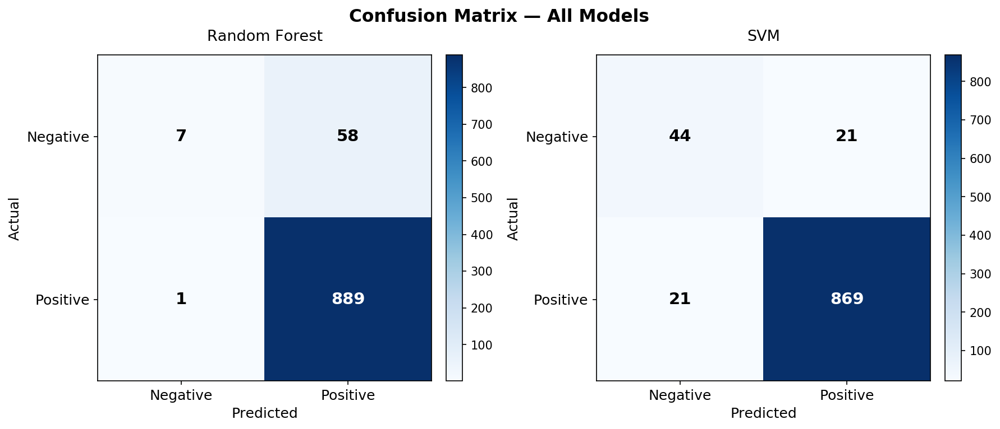
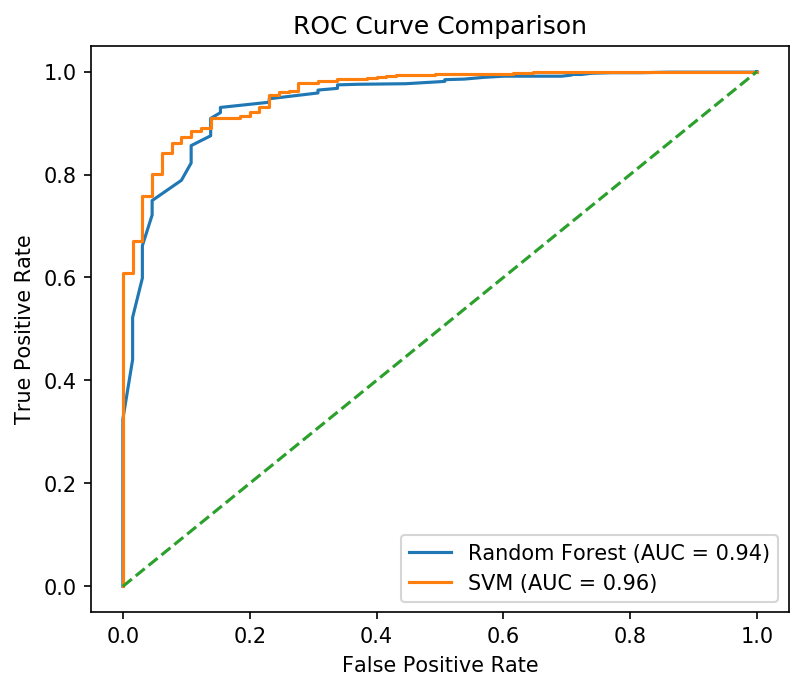

End-to-end machine learning project for sentiment classification of Amazon product reviews using classical NLP techniques.

---

## 📌 Overview

This project demonstrates a complete machine learning workflow applied to real-world text data. The goal is to classify customer reviews as positive or negative sentiment and evaluate model performance using multiple metrics beyond accuracy.

It highlights how Natural Language Processing (NLP) and machine learning can be used to extract actionable insights from customer feedback.

---

## 🎯 Problem Statement

Online reviews contain valuable information about customer opinions, but analyzing them manually is not scalable.

The objective of this project is to build a machine learning model that can automatically classify Amazon product reviews into positive or negative sentiment.

---

## 📂 Dataset

The dataset consists of Amazon customer reviews with associated star ratings used to derive sentiment labels.

- ⭐⭐⭐⭐⭐ 4–5 stars → **Positive**
- ⭐ 1–2 stars → **Negative**
- ⭐⭐⭐ 3 stars → Excluded (neutral)

> Download the dataset from Kaggle and place it as `data/amazon_reviews.csv`
> 🔗 [Amazon Product Reviews – Kaggle](https://www.kaggle.com/datasets/halimedogan/amazon-reviews)

---

## 🚀 Approach

The project follows a standard machine learning pipeline:

- Data loading, cleaning, and exploration
- Text preprocessing (lowercasing, punctuation removal, stopword removal, lemmatization)
- Feature extraction using **TF-IDF Vectorization** (2000 features, bigrams)
- Model training using:
  - Random Forest
  - Support Vector Machine (SVM)
- Cross-validation using **scikit-learn Pipelines** to prevent data leakage
- Model evaluation using:
  - Accuracy
  - Precision, Recall, F1-score
  - ROC-AUC

---

## 📊 Results

### Model Performance

| Model         | Accuracy   | ROC-AUC  |
| ------------- | ---------- | -------- |
| Random Forest | 93.82%     | 0.95     |
| **SVM**       | **95.60%** | **0.96** |

### Classification Report

|                | Precision | Recall | F1-Score |
| -------------- | --------- | ------ | -------- |
| RF — Negative  | 87.50%    | 10.77% | 19.18%   |
| RF — Positive  | 93.88%    | 99.89% | 96.79%   |
| SVM — Negative | 67.69%    | 67.69% | 67.69%   |
| SVM — Positive | 97.64%    | 97.64% | 97.64%   |

> ⚠️ The dataset is heavily imbalanced (~93% positive reviews). Accuracy alone is misleading.
> SVM is the better model — it correctly catches **67.69%** of negative reviews vs only **10.77%** for Random Forest.

---

## 📈 Visualizations

### Confusion Matrix



### ROC Curve



### Class Distribution


---

## 💼 Business Insights

- Customer sentiment can be automatically extracted at scale
- Helps businesses understand customer satisfaction trends
- Enables data-driven decision-making for product improvements
- Can be integrated into real-time review monitoring systems

---

## 🛠️ Tech Stack

- Python
- Pandas
- NumPy
- Scikit-learn
- NLTK
- Matplotlib
- Seaborn

---

## 📂 Project Structure

```text
amazon-sentiment-analysis/
├── notebooks/
│   └── amazon_sentiment_analysis.ipynb
├── images/
│   ├── confusion_matrix.png
│   ├── roc_curve.png
|   └── class_distribution.png
├── requirements.txt
└── README.md
```

> Note: `data/` is not included in the repository. Download the dataset from Kaggle (link above).

---

## ▶️ How to Run

1. Clone the repository

```bash
git clone https://github.com/ozairshafique/amazon-sentiment-analysis.git
cd amazon-sentiment-analysis
```

2. Create a virtual environment (optional)

```bash
python -m venv venv
source venv/bin/activate   # Windows: venv\Scripts\activate
```

3. Install dependencies

```bash
pip install -r requirements.txt
```

4. Download the dataset from Kaggle and place it at:

```
data/amazon_reviews.csv
```

5. Launch Jupyter Notebook

```bash
jupyter notebook
```

6. Open:

```
notebooks/amazon_sentiment_analysis.ipynb
```

---

## 📌 Requirements

- Python 3.x
- Jupyter Notebook

---

## 🧠 Key Learnings

- Importance of proper text preprocessing in NLP tasks
- How to use **scikit-learn Pipelines** to prevent data leakage during cross-validation
- Why accuracy alone is misleading with imbalanced datasets
- Practical implementation of TF-IDF for real-world text classification

---

## 🔮 Future Improvements

- Compare with Transformer-based models (e.g., BERT)
- Handle class imbalance with oversampling (SMOTE)
- Perform hyperparameter tuning with GridSearchCV
- Deploy model using a REST API (Flask or FastAPI)
- Build an interactive dashboard

---

## 🏁 Conclusion

This project demonstrates how machine learning and NLP can be used to transform unstructured text data into meaningful insights. The Linear SVM achieved **95.60% accuracy** and a **ROC-AUC of 0.96**, making it the best performing model for this task.

---

## 👤 Author

Uzair Shafique

- GitHub: https://github.com/ozairshafique

---

## 📬 Contact

- Email: uzair_11@hotmail.com
