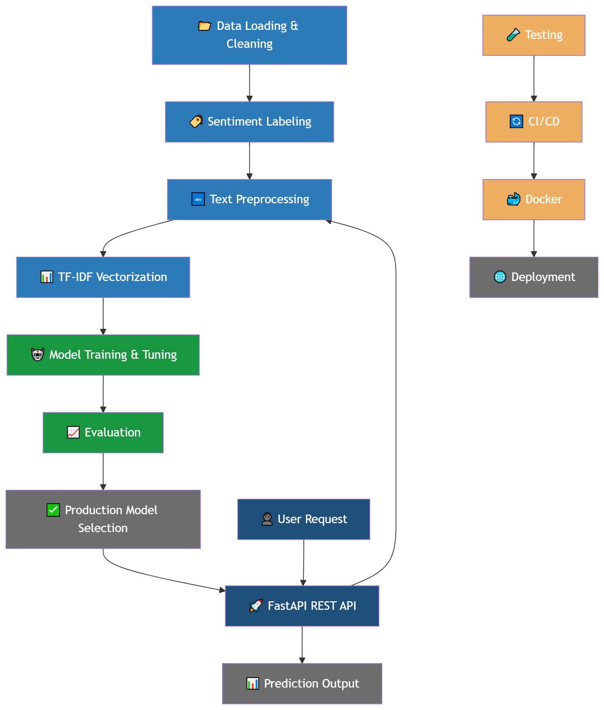

# 🛍️ Amazon Sentiment Analysis API

End-to-end machine learning project for sentiment classification of Amazon product reviews — from data exploration to a production-ready REST API.


## Table of Contents

- [Overview](#-overview)
- [Problem Statement](#-problem-statement)
- [Dataset](#-dataset)
- [Approach](#-approach)
- [Results](#-results)
  - [Model Comparison](#model-comparison)
- [Visualizations](#-visualizations)
- [Tech Stack](#-tech-stack)
- [Project Structure](#-project-structure)
- [How to Run](#-how-to-run)
  - [Option 1 — Local](#option-1--local)
  - [Option 2 — Docker](#option-2--docker)
- [API Endpoints](#-api-endpoints)
- [Testing](#-testing)
- [CI/CD Pipeline](#-cicd-pipeline)
- [Key Learnings](#-key-learnings)
- [Future Improvements](#-future-improvements)
- [Conclusion](#-conclusion)
- [Author](#-author)
- [Contact](#-contact)

---

## 📌 Overview

This project demonstrates a complete machine learning lifecycle:

- Data exploration and model comparison in Jupyter
- Clean training pipeline with GridSearchCV
- Production REST API built with FastAPI
- Containerized with Docker
- Automated CI/CD with GitHub Actions
- 15 pytest tests with 63% coverage

---

## 🎯 Problem Statement

Online reviews contain valuable information about customer opinions, but analyzing them manually is not scalable.

The objective is to build a machine learning model that automatically classifies Amazon product reviews as **positive** or **negative** sentiment.

---

## 📂 Dataset

The dataset consists of Amazon customer reviews with associated star ratings used to derive sentiment labels.

| Stars                | Label    | Encoded |
| -------------------- | -------- | ------- |
| ⭐⭐⭐⭐⭐ 4–5 stars | Positive | 1       |
| ⭐ 1–2 stars         | Negative | 0       |
| ⭐⭐⭐ 3 stars       | Neutral  | Dropped |

| Sentiment           | Count      | Ratio |
| ------------------- | ---------- | ----- |
| Positive            | 4,448      | 93%   |
| Negative            | 324        | 7%    |
| **Imbalance ratio** | **13.7:1** |       |

> Download the dataset from Kaggle and place it as `data/amazon_reviews.csv`
> 🔗 [Amazon Product Reviews – Kaggle](https://www.kaggle.com/datasets/halimedogan/amazon-reviews)

---

## 🚀 Approach



---

## 📊 Results

### Model Comparison

| Model                   | CV Macro F1 | ROC-AUC   | Production          |
| ----------------------- | ----------- | --------- | ------------------- |
| Random Forest           | 0.512       | 0.961     | ❌ Baseline only    |
| SVC                     | 0.840       | 0.968     | ❌ Too slow         |
| **Logistic Regression** | **0.841**   | **0.965** | ✅ **Selected**     |
| LinearSVC               | 0.847       | 0.967     | ❌ No predict_proba |

### Why Logistic Regression?

| Criterion        | LogReg    | LinearSVC         | SVC        | Random Forest |
| ---------------- | --------- | ----------------- | ---------- | ------------- |
| CV Macro F1      | ✅ Best   | ✅ Similar        | ✅ Similar | ❌ Lowest     |
| predict_proba()  | ✅ Native | ❌ Wrapper needed | ⚠️ Slow    | ✅ Native     |
| Inference speed  | ✅ Fast   | ✅ Fast           | ⚠️ Slow    | ❌ Slow       |
| Production ready | ✅        | ❌                | ❌         | ❌            |

> ⚠️ Accuracy alone is misleading with 13.7:1 class imbalance.
> **F1 macro** is used as the primary evaluation metric.

---

## 📈 Visualizations

### Confusion Matrix


### ROC Curve


### Class Distribution


### Cross-Validated Macro F1


---

## 🛠️ Tech Stack

| Category         | Tools                       |
| ---------------- | --------------------------- |
| Language         | Python 3.12                 |
| ML               | Scikit-learn, NumPy, Pandas |
| NLP              | NLTK, TextBlob              |
| API              | FastAPI, Uvicorn, Pydantic  |
| Testing          | Pytest, pytest-cov          |
| Containerization | Docker                      |
| CI/CD            | GitHub Actions              |
| Visualization    | Matplotlib, Seaborn         |

---

## 📂 Project Structure

```
amazon-sentiment-analysis/
│
├── .github/
│   └── workflows/
│       └── ci.yml                    # GitHub Actions CI/CD
│
├── src/
│   ├── __init__.py
│   ├── preprocessing.py              # TextPreprocessor (sklearn compatible)
│   ├── model_loader.py               # Lazy model loading & inference
│   └── train.py                      # Training pipeline with GridSearchCV
│
├── api/
│   ├── __init__.py
│   ├── main.py                       # FastAPI application
│   └── schemas.py                    # Pydantic request/response schemas
│
├── tests/
│   ├── __init__.py
│   ├── test_preprocessing.py         # 5 tests — 100% coverage
│   ├── test_model.py                 # 8 tests — 83% coverage
│   └── test_api.py                   # 2 tests
│
├── notebooks/
│   └── amazon_sentiment_analysis.ipynb
│
├── model/                            # Saved .pkl files (not in git)
├── data/                             # Dataset CSV
├── images/                           # Visualizations
│
├── Dockerfile
├── requirements.txt
├── pytest.ini
├── .dockerignore
└── README.md
```

---

## ▶️ How to Run

### Option 1 — Local

```bash
# 1. Clone the repository
git clone https://github.com/ozairshafique/amazon-sentiment-analysis.git
cd amazon-sentiment-analysis

# 2. Create virtual environment
python -m venv venv
source venv/bin/activate   # Windows: venv\Scripts\activate

# 3. Install dependencies
pip install -r requirements.txt

# 4. Download NLTK data
python -m nltk.downloader stopwords wordnet

# 5. Download dataset from Kaggle and place at:
#    data/amazon_reviews.csv

# 6. Train the model
python src/train.py

# 7. Run the API
uvicorn api.main:app --reload
```

### Option 2 — Docker

```bash
# 1. Build image
docker build -t amazon-sentiment-analysis .

# 2. Run container
docker run -p 8000:8000 amazon-sentiment-analysis
```

---

## 🌐 API Endpoints

| Method | Endpoint         | Description                |
| ------ | ---------------- | -------------------------- |
| GET    | `/`              | API info                   |
| GET    | `/health`        | Health check               |
| POST   | `/predict`       | Single prediction          |
| POST   | `/predict/batch` | Batch prediction (max 100) |

### Single Prediction Example

```bash
curl -X POST "http://localhost:8000/predict" \
     -H "Content-Type: application/json" \
     -d "{\"text\": \"This product is amazing!\", \"model_name\": \"logreg\"}"
```

### Response

```json
{
  "text": "This product is amazing!",
  "model": "logreg",
  "sentiment": "positive",
  "confidence": 0.9808
}
```

### Batch Prediction Example

```json
[
  { "text": "Amazing product!", "model_name": "logreg" },
  { "text": "Terrible quality!", "model_name": "logreg" },
  { "text": "Great value for money!", "model_name": "logreg" }
]
```

### Batch Response

```json
{
  "total": 3,
  "results": [
    {
      "text": "Amazing product!",
      "model": "logreg",
      "sentiment": "positive",
      "confidence": 0.98
    },
    {
      "text": "Terrible quality!",
      "model": "logreg",
      "sentiment": "negative",
      "confidence": 0.75
    },
    {
      "text": "Great value for money!",
      "model": "logreg",
      "sentiment": "positive",
      "confidence": 0.99
    }
  ]
}
```

> 📖 Interactive API docs available at: `http://localhost:8000/docs`

---

## 🧪 Testing

```bash
# Run all tests
pytest tests/ -v

# Run with coverage
pytest tests/ -v --cov=src --cov-report=term-missing
```

### Coverage Report

| File               | Coverage |
| ------------------ | -------- |
| `preprocessing.py` | 100% ✅  |
| `model_loader.py`  | 83% ✅   |
| `train.py`         | 41% ⚠️   |
| **Total**          | **63%**  |

> 15 tests covering preprocessing, model inference, and API endpoints.

---

## ⚙️ CI/CD Pipeline

Every push to `main` automatically:

1. Sets up Python 3.12
2. Installs dependencies
3. Downloads NLTK data
4. Trains the model
5. Runs all 15 tests
6. Builds Docker image

---

## 🧠 Key Learnings

- Why accuracy is misleading with imbalanced datasets
- How sklearn Pipelines prevent data leakage
- Why linear models outperform Random Forest on sparse TF-IDF features
- Production model selection based on multiple criteria
- FastAPI best practices for ML APIs
- Docker containerization for ML applications
- CI/CD automation with GitHub Actions

---

## 🔮 Future Improvements

- Add MLflow for experiment tracking
- Fine-tune DistilBERT for better contextual understanding
- Add LIME/SHAP for prediction explainability
- Collect more negative reviews to reduce class imbalance
- Deploy to Railway or Render

---

## 🏁 Conclusion

This project demonstrates the complete ML lifecycle from raw data to a production-ready API. Logistic Regression was selected as the production model achieving **CV Macro F1 of 0.841** and **ROC-AUC of 0.965** — the best balance of performance, speed, and interpretability.

The API is fully containerized with Docker, tested with 15 pytest tests achieving 63% coverage, and automated with a GitHub Actions CI/CD pipeline.

---

## 👤 Author

**Uzair Shafique**

- GitHub: [ozairshafique](https://github.com/ozairshafique)

---

## 📬 Contact

- Email: uzair_11@hotmail.com
