# 🛍️ Amazon Sentiment Analysis — MLOps Pipeline

> End-to-end MLOps system: from raw Amazon reviews to a **live, monitored, production REST API** deployed on AWS.

[](https://python.org)
[](https://fastapi.tiangolo.com)
[](https://mlflow.org)
[](https://docker.com)
[](https://aws.amazon.com)
[](https://prometheus.io)
[](https://grafana.com)
[](https://github.com/ozairshafique/amazon-sentiment-analysis/actions)
[](https://github.com/ozairshafique/amazon-sentiment-analysis)
[](https://github.com/ozairshafique/amazon-sentiment-analysis)

---

## 📋 Table of Contents

- [Live Demo](#-live-demo)
- [Overview](#-overview)
- [Problem Statement](#-problem-statement)
- [Dataset](#-dataset)
- [Architecture](#-architecture)
- [Model Results](#-model-results)
- [MLflow Experiment Tracking](#-mlflow-experiment-tracking)
- [Grafana Monitoring Dashboard](#-grafana-monitoring-dashboard)
- [Prometheus Targets](#-prometheus-targets)
- [CloudWatch Monitoring](#-cloudwatch-monitoring)
- [FastAPI Documentation](#-fastapi-documentation)
- [ML Visualizations](#-ml-visualizations)
- [Tech Stack](#️-tech-stack)
- [Project Structure](#-project-structure)
- [Environment Variables](#-environment-variables)
- [How to Run](#️-how-to-run)
- [API Endpoints](#-api-endpoints)
- [Testing](#-testing)
- [CI/CD Pipeline](#️-cicd-pipeline)
- [Reproducibility](#-reproducibility)
- [Troubleshooting](#-troubleshooting)
- [Key Learnings](#-key-learnings)
- [Future Improvements](#-future-improvements)
- [Known Limitations](#️-known-limitations)
- [Contributing](#-contributing)
- [License](#-license)
- [Conclusion](#-conclusion)
- [Author](#-author)

---

## 🔗 Live Demo

| Service       | URL                                                              | Status                                                      |
| ------------- | ---------------------------------------------------------------- | ----------------------------------------------------------- |
| 🚀 FastAPI    | [http://63.180.13.157:8000/docs](http://63.180.13.157:8000/docs) |  |
| 📊 Grafana    | [http://63.180.13.157:3001](http://63.180.13.157:3001)           |  |
| 📈 Prometheus | [http://63.180.13.157:9090](http://63.180.13.157:9090)           |  |

---

## 📌 Overview

This project showcases a **production-grade MLOps pipeline** built entirely from scratch:

- 🔬 **ML Training** — GridSearchCV + MLflow experiment tracking
- 🚀 **REST API** — FastAPI with single & batch prediction endpoints
- 🐳 **Containerization** — Docker Compose orchestrating 3 services
- ☁️ **Cloud Deployment** — AWS EC2 with S3 model storage
- 📡 **Real-time Monitoring** — Prometheus + Grafana (8 panels)
- 🔍 **Infrastructure Monitoring** — AWS CloudWatch
- ✅ **Quality Assurance** — 98% test coverage + CI/CD pipeline

---

## 🏗️ Architecture

> Full system architecture showing AWS infrastructure, Docker Compose services, and component interactions.

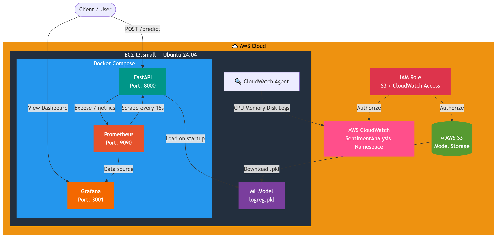

### 🔄 Data Flow

> Complete ML pipeline from raw data to production deployment with monitoring.

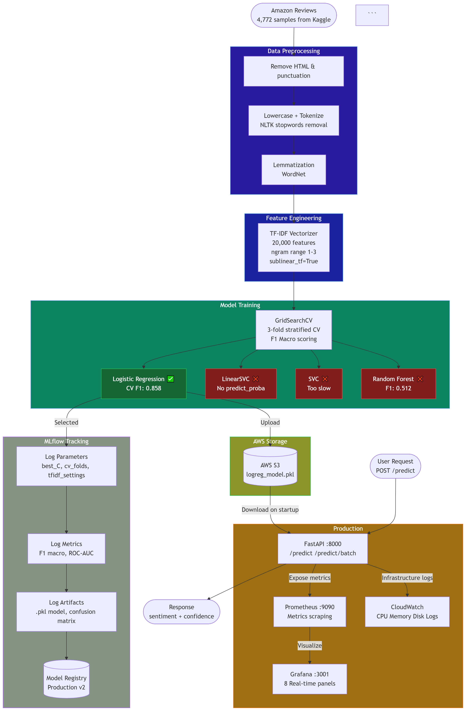

---

## 🎯 Problem Statement

Amazon product reviews contain rich customer sentiment but are impossible to analyze at scale manually. This system automatically classifies reviews as **positive** or **negative** with **86%+ model confidence**, tracked in real time.

---

## 📂 Dataset

| Stars            | Label    | Encoded |
| ---------------- | -------- | ------- |
| ⭐⭐⭐⭐⭐ (4–5) | Positive | 1       |
| ⭐ (1–2)         | Negative | 0       |
| ⭐⭐⭐ (3)       | Neutral  | Dropped |

| Split        | Positive    | Negative | Imbalance  |
| ------------ | ----------- | -------- | ---------- |
| Full dataset | 4,448 (93%) | 324 (7%) | **13.7:1** |

> 🔗 [Amazon Product Reviews — Kaggle](https://www.kaggle.com/datasets/halimedogan/amazon-reviews)
> Place dataset at `data/amazon_reviews.csv`

---

## 📊 Model Results

### Performance Comparison

| Metric           | Logistic Regression | LinearSVC |   SVC | Random Forest |
| ---------------- | ------------------: | --------: | ----: | ------------: |
| CV Macro F1      |           **0.858** |     0.850 | 0.840 |         0.512 |
| Test F1 Macro    |           **0.852** |     0.835 |     — |             — |
| Test F1 Positive |           **0.980** |     0.975 |     — |             — |
| Test F1 Negative |           **0.724** |     0.694 |     — |             — |
| ROC-AUC          |               0.967 | **0.968** | 0.968 |         0.961 |
| Selected         |          ✅ **Yes** |        ❌ |    ❌ |            ❌ |

### Why Logistic Regression?

| Criterion         | LogReg    | LinearSVC  | SVC        | Random Forest |
| ----------------- | --------- | ---------- | ---------- | ------------- |
| Best CV F1        | ✅        | ✅ Similar | ✅ Similar | ❌            |
| `predict_proba()` | ✅ Native | ❌ Wrapper | ⚠️ Slow    | ✅            |
| Inference Speed   | ✅ Fast   | ✅ Fast    | ❌ Slow    | ❌ Slow       |
| Production Ready  | ✅        | ❌         | ❌         | ❌            |

> ⚠️ **Note:** Accuracy is misleading with 13.7:1 class imbalance. **F1 Macro** is the primary metric.

---

## 🔬 MLflow Experiment Tracking

All runs tracked with **MLflow 3.1.1** for full reproducibility.

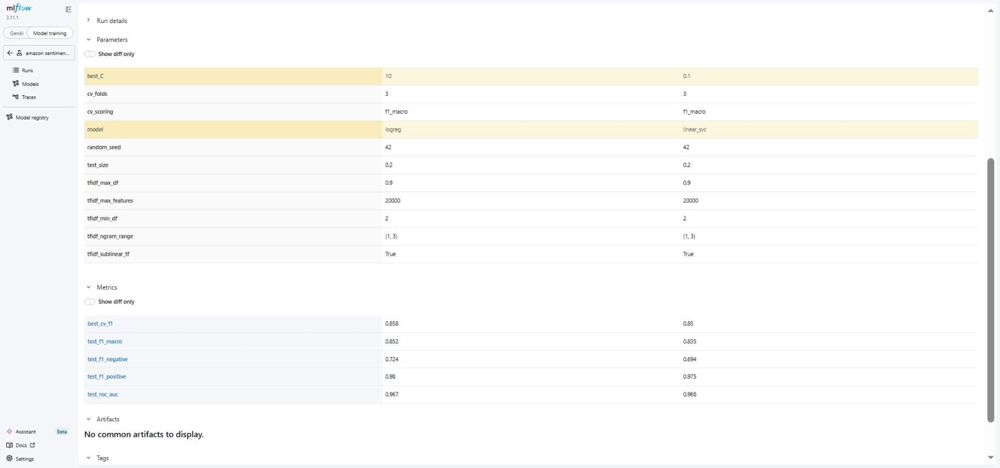

### Logged Per Run

| Category       | Details                                               |
| -------------- | ----------------------------------------------------- |
| **Parameters** | model, best_C, cv_folds, tfidf settings, random_seed  |
| **Metrics**    | cv_f1, test_f1_macro, test_f1_negative, roc_auc       |
| **Artifacts**  | confusion matrix, classification report, `.pkl` model |

```bash
# View all experiments
mlflow ui  # → http://localhost:5000
```

### Model Registry

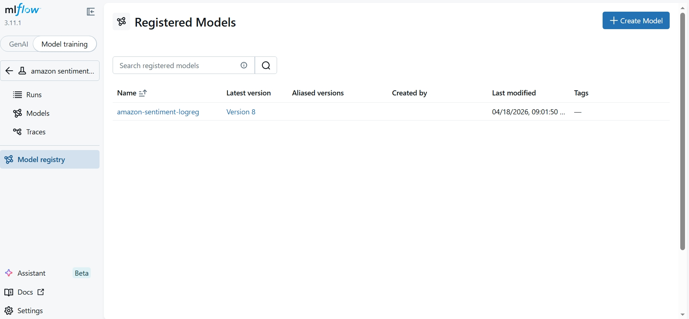

| Model                   | Version | Stage         | CV F1 |
| ----------------------- | ------- | ------------- | ----- |
| amazon-sentiment-logreg | 2       | ✅ Production | 0.858 |
| amazon-sentiment-logreg | 1       | 📦 Archived   | —     |

---

## 📡 Grafana Monitoring Dashboard

Real-time API monitoring with **8 custom panels**.

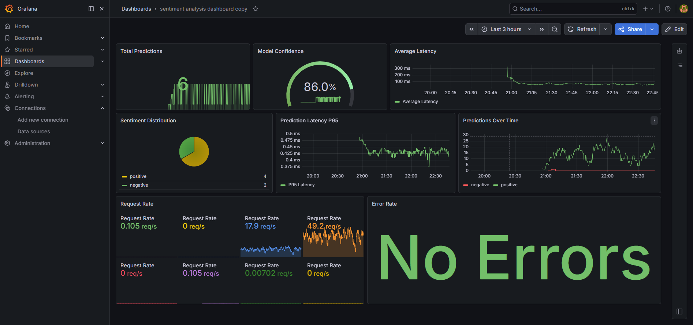

| Panel                  | Type        | Query                                          |
| ---------------------- | ----------- | ---------------------------------------------- |
| Total Predictions      | Stat        | `sum(sentiment_predictions_total)`             |
| Model Confidence       | Gauge       | `model_confidence_score`                       |
| Average Latency        | Time Series | `sentiment_prediction_latency_seconds`         |
| Sentiment Distribution | Pie Chart   | `sentiment_predictions_total`                  |
| Latency P95            | Time Series | `histogram_quantile(0.95, ...)`                |
| Predictions Over Time  | Time Series | `increase(sentiment_predictions_total[5m])`    |
| Request Rate           | Time Series | `rate(http_requests_total[5m])`                |
| Error Rate             | Stat        | `rate(http_requests_total{status=~"5.."}[5m])` |

### Import Dashboard

```bash
# 1. Open Grafana → Dashboards → Import
# 2. Upload monitoring/grafana-dashboard.json
# 3. Select Prometheus datasource → Import
```

---

## 📈 Prometheus Targets

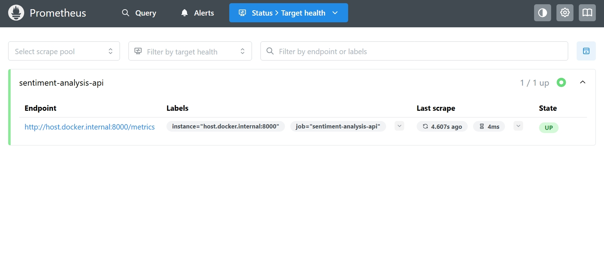

- ✅ `sentiment-analysis-api` — **1/1 UP**
- Scrape interval: every 15s
- Last scrape duration: ~4ms

---

## ☁️ AWS CloudWatch Monitoring

Infrastructure monitoring with custom **SentimentAnalysis** namespace.

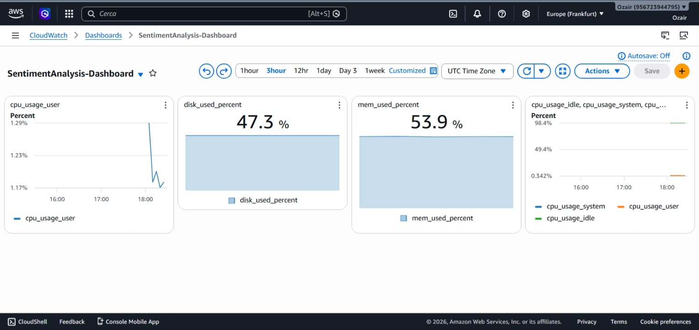

| Metric       | Value     | Interval  |
| ------------ | --------- | --------- |
| CPU Usage    | ~1.3%     | 60s       |
| Memory Usage | ~53.9%    | 60s       |
| Disk Usage   | ~47.3%    | 60s       |
| Docker Logs  | Streaming | Real-time |

### Alarms Configured

- 🔴 Memory > 80% → Alert
- 🔴 CPU > 80% → Alert

```bash
# Setup CloudWatch agent
bash monitoring/setup-cloudwatch.sh
```

---

## 🌐 FastAPI Documentation

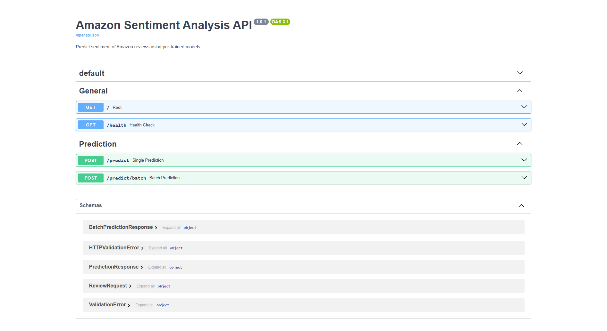

---

## 📈 ML Visualizations

| Confusion Matrix                                   | ROC Curve                           |
| -------------------------------------------------- | ----------------------------------- |
| 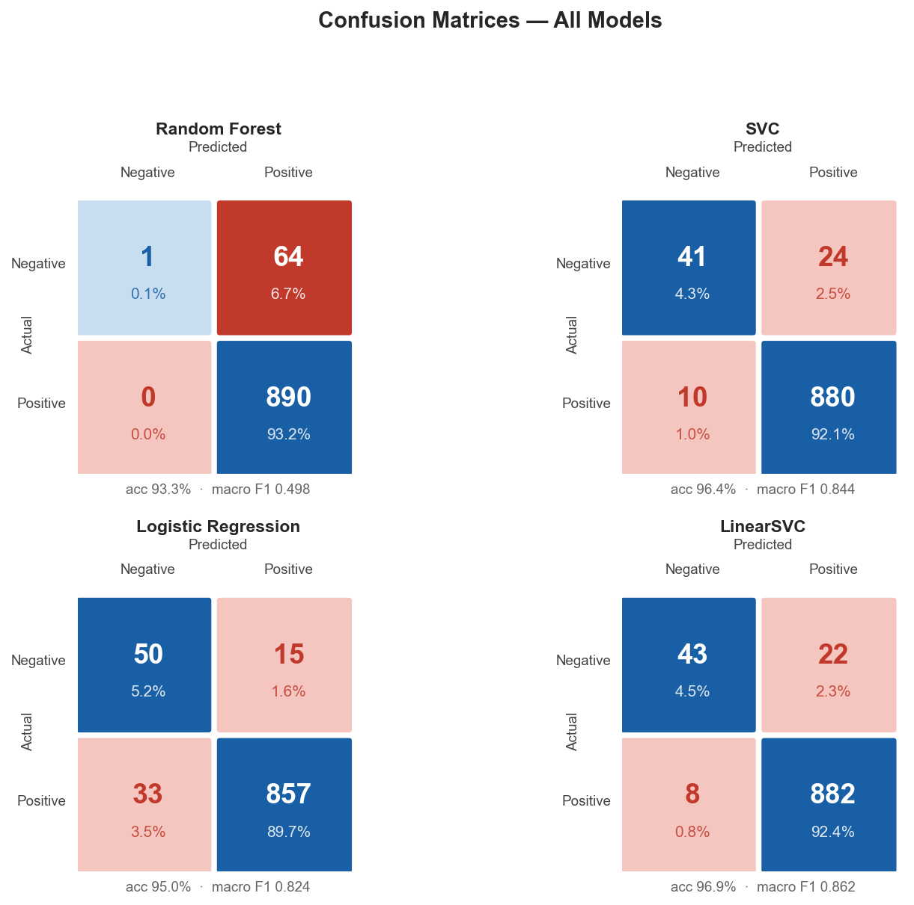 | 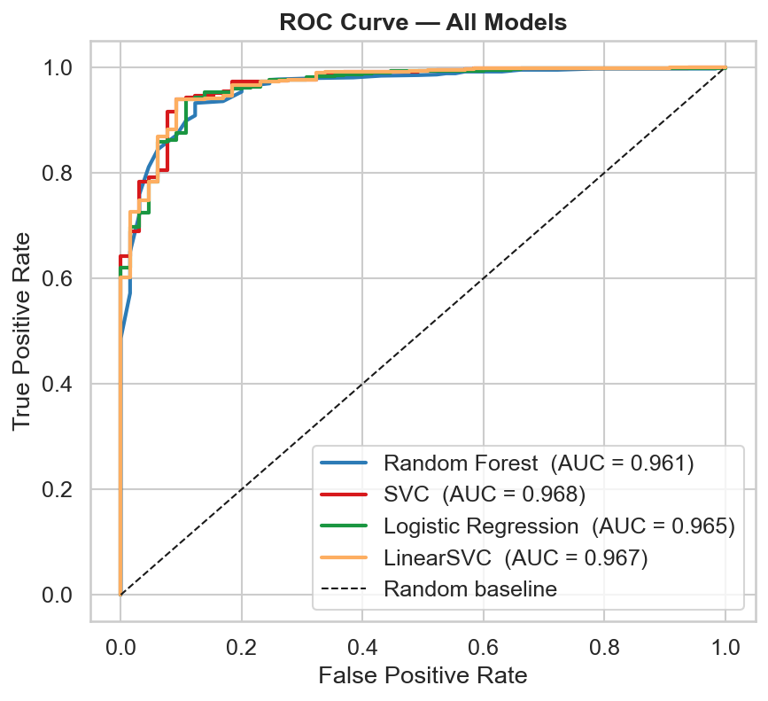 |

| Class Distribution                                   | CV F1 Comparison                      |
| ---------------------------------------------------- | ------------------------------------- |
| 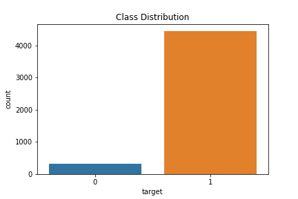 | 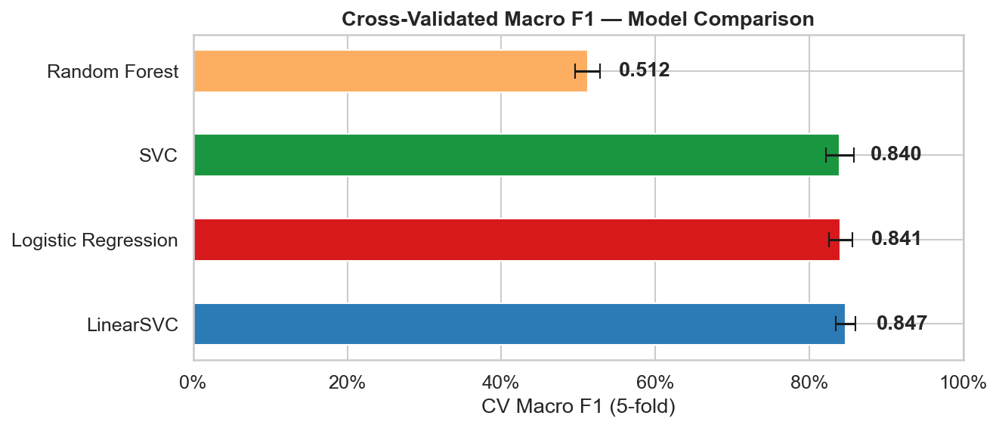 |

---

## 🛠️ Tech Stack

| Category                | Tools                               |
| ----------------------- | ----------------------------------- |
| **Language**            | Python 3.12                         |
| **ML**                  | Scikit-learn, NumPy, Pandas         |
| **NLP**                 | NLTK, TextBlob                      |
| **API**                 | FastAPI, Uvicorn, Pydantic          |
| **Experiment Tracking** | MLflow 3.1.1                        |
| **Monitoring**          | Prometheus, Grafana, AWS CloudWatch |
| **Containerization**    | Docker, Docker Compose              |
| **Cloud**               | AWS EC2, S3, IAM, CloudWatch        |
| **CI/CD**               | GitHub Actions                      |
| **Testing**             | Pytest, pytest-cov (98% coverage)   |
| **Visualization**       | Matplotlib, Seaborn                 |

---

## 📂 Project Structure

```
amazon-sentiment-analysis/
│
├── .github/workflows/
│   └── ci.yml                       # GitHub Actions CI/CD
│
├── api/
│   ├── main.py                      # FastAPI app + Prometheus metrics
│   └── schemas.py                   # Pydantic schemas
│
├── src/
│   ├── preprocessing.py             # sklearn-compatible TextPreprocessor
│   ├── model_loader.py              # Lazy model loading
│   └── train.py                     # GridSearchCV + MLflow pipeline
│
├── monitoring/
│   ├── prometheus.yml               # Scrape config
│   ├── grafana-dashboard.json       # 8-panel dashboard (importable)
│   ├── cloudwatch-config.json       # CloudWatch agent config
│   ├── cloudwatch-dashboard.json    # CloudWatch dashboard
│   └── setup-cloudwatch.sh         # One-command CloudWatch setup
│
├── tests/
│   ├── test_preprocessing.py        # 100% coverage
│   ├── test_model.py                # 92% coverage
│   └── test_api.py
│
├── images/                          # Screenshots & visualizations
├── notebooks/                       # Jupyter analysis
├── mlruns/                          # MLflow tracking (git-ignored)
├── model/                           # .pkl files (git-ignored)
├── data/                            # Dataset (git-ignored)
│
├── Dockerfile
├── docker-compose.yml
├── requirements.txt
├── pytest.ini
└── README.md
```

---

## 🔐 Environment Variables

Create a `.env` file in the project root:

```bash
cp .env.example .env
```

| Variable                 | Description             | Default                |
| ------------------------ | ----------------------- | ---------------------- |
| `GRAFANA_ADMIN`          | Grafana admin username  | `your_username`        |
| `GRAFANA_ADMIN_PASSWORD` | Grafana admin password  | `your_secure_password` |
| `PYTHONUNBUFFERED`       | Python output buffering | `1`                    |

### `.env.example`

```env
# Grafana credentials
GRAFANA_ADMIN=your_username
GRAFANA_ADMIN_PASSWORD=your_secure_password

# Python
PYTHONUNBUFFERED=1
```

> ⚠️ Never commit `.env` to GitHub — it's already in `.gitignore`

---

## ▶️ How to Run

### Option 1 — Local Development

```bash
# Clone
git clone https://github.com/ozairshafique/amazon-sentiment-analysis.git
cd amazon-sentiment-analysis

# Setup environment
python -m venv venv && source venv/bin/activate
pip install -r requirements.txt
python -m nltk.downloader stopwords wordnet

# Place dataset at data/amazon_reviews.csv

# Train model
python src/train.py

# View experiments
mlflow ui   # → http://localhost:5000

# Start API
uvicorn api.main:app --reload  # → http://localhost:8000
```

### Option 2 — Docker Compose (Recommended)

```bash
# Configure environment
cp .env.example .env  # set GRAFANA_ADMIN and GRAFANA_ADMIN_PASSWORD

# Start all services
docker-compose up -d

# Services running at:
# FastAPI    → http://localhost:8000/docs
# Prometheus → http://localhost:9090
# Grafana    → http://localhost:3001
```

### Option 3 — AWS EC2 Deployment

```bash
# SSH into EC2
ssh -i your-key.pem ubuntu@YOUR_EC2_IP

# Clone & setup
git clone https://github.com/ozairshafique/amazon-sentiment-analysis.git
cd amazon-sentiment-analysis

# Download model from S3
aws s3 cp s3://your-bucket/logreg_model.pkl ./model/

# Configure
cp .env.example .env

# Launch
docker-compose up -d

# Setup CloudWatch monitoring
bash monitoring/setup-cloudwatch.sh
```

---

## 🌐 API Endpoints

| Method | Endpoint         | Description                 |
| ------ | ---------------- | --------------------------- |
| `GET`  | `/`              | API info                    |
| `GET`  | `/health`        | Health check                |
| `GET`  | `/metrics`       | Prometheus metrics          |
| `POST` | `/predict`       | Single prediction           |
| `POST` | `/predict/batch` | Batch predictions (max 100) |

### Single Prediction

```bash
curl -X POST "http://63.180.13.157:8000/predict" \
  -H "Content-Type: application/json" \
  -d '{"text": "This product is amazing!", "model_name": "logreg"}'
```

```json
{
  "text": "This product is amazing!",
  "model": "logreg",
  "sentiment": "positive",
  "confidence": 0.9808
}
```

### Batch Prediction

```bash
curl -X POST "http://63.180.13.157:8000/predict/batch" \
  -H "Content-Type: application/json" \
  -d '[
    {"text": "Amazing product!", "model_name": "logreg"},
    {"text": "Terrible quality!", "model_name": "logreg"},
    {"text": "Great value for money!", "model_name": "logreg"}
  ]'
```

```json
{
  "total": 3,
  "results": [
    { "sentiment": "positive", "confidence": 0.98 },
    { "sentiment": "negative", "confidence": 0.75 },
    { "sentiment": "positive", "confidence": 0.99 }
  ]
}
```

> 📖 Full interactive docs: **[http://63.180.13.157:8000/docs](http://63.180.13.157:8000/docs)**

---

## 🧪 Testing

```bash
# Run all tests
pytest tests/ -v

# With coverage report
pytest tests/ -v --cov=src --cov-report=term-missing
```

| Module             | Coverage   |
| ------------------ | ---------- |
| `preprocessing.py` | 100% ✅    |
| `train.py`         | 99% ✅     |
| `model_loader.py`  | 83% ✅     |
| **Total**          | **98%** ✅ |

---

## ⚙️ CI/CD Pipeline

Every push to `main` triggers:

```
1. Environment Setup    → Python 3.12 + dependencies
2. NLTK Download        → stopwords + wordnet
3. Model Training       → src/train.py + MLflow logging
4. Test Suite           → 20+ tests, 97% coverage enforced
5. Docker Build         → image built & validated
```

---

## 🔁 Reproducibility

| Factor           | Value             |
| ---------------- | ----------------- |
| Random seed      | 42                |
| Train/test split | 80/20 stratified  |
| CV strategy      | 3-fold stratified |
| CV scoring       | F1 macro          |
| Tracking         | MLflow 3.1.1      |

---

## 🔧 Troubleshooting

### Docker Issues

| Error                           | Cause                      | Fix                                              |
| ------------------------------- | -------------------------- | ------------------------------------------------ |
| `permission denied docker.sock` | User not in docker group   | `sudo usermod -aG docker $USER && newgrp docker` |
| `ContainerConfig KeyError`      | Old docker-compose version | Upgrade to v2.24+                                |
| `HTTP timeout`                  | Slow network / low memory  | `export COMPOSE_HTTP_TIMEOUT=300`                |
| `port already in use`           | Port conflict              | `docker-compose down && docker-compose up -d`    |

### AWS Issues

| Error                    | Cause                        | Fix                                            |
| ------------------------ | ---------------------------- | ---------------------------------------------- |
| `Connection timed out`   | Security group blocking port | Add inbound rule for port 8000/3001/9090       |
| `ERR_CONNECTION_REFUSED` | Container not running        | `docker-compose ps` and check logs             |
| `Access Denied S3`       | IAM role missing             | Attach `AmazonS3ReadOnlyAccess` to EC2 role    |
| Low memory warnings      | t3.micro too small           | Add 2GB swap: `sudo fallocate -l 2G /swapfile` |

### Grafana Issues

| Error               | Cause                    | Fix                                            |
| ------------------- | ------------------------ | ---------------------------------------------- |
| `Login failed`      | Wrong credentials        | Try `admin/admin` (default)                    |
| `No data in panels` | Prometheus not connected | Check datasource URL: `http://prometheus:9090` |
| `Plugin error`      | Datasource missing       | Add Prometheus datasource first                |

### API Issues

| Error                  | Cause                | Fix                                               |
| ---------------------- | -------------------- | ------------------------------------------------- |
| `Model not found`      | .pkl file missing    | `aws s3 cp s3://bucket/logreg_model.pkl ./model/` |
| `500 Internal Error`   | Model loading failed | Check `docker-compose logs app`                   |
| `422 Validation Error` | Wrong request format | Check API schema at `/docs`                       |

---

## 🤝 Contributing

Contributions are welcome! Here's how:

```bash
# 1. Fork the repository
# 2. Create your feature branch
git checkout -b feature/amazing-feature

# 3. Make your changes
# 4. Run tests
pytest tests/ -v --cov=src

# 5. Commit your changes
git commit -m "Add amazing feature"

# 6. Push to branch
git push origin feature/amazing-feature

# 7. Open a Pull Request
```

### Development Setup

```bash
# Install dev dependencies
pip install -r requirements.txt

# Run tests with coverage
pytest tests/ -v --cov=src --cov-report=html

# View coverage report
open htmlcov/index.html
```

### Code Style

- Follow PEP 8
- Add docstrings to all functions
- Write tests for new features
- Keep test coverage above 95%

---

## 📄 License

This project is licensed under the **MIT License** — see the [LICENSE](LICENSE) file for details.

---

## 🧠 Key Learnings

- Class imbalance handling — why F1 macro beats accuracy
- sklearn Pipeline design to prevent data leakage
- Multi-criteria model selection for production
- MLflow experiment tracking and model registry
- Prometheus metric instrumentation in FastAPI
- Docker Compose multi-service orchestration
- AWS EC2 deployment, S3 storage, IAM roles
- CloudWatch agent configuration and dashboards
- GitHub Actions CI/CD for ML pipelines

---

## 🔮 Future Improvements

- [x] ~~Prometheus + Grafana monitoring~~ ✅
- [x] ~~AWS EC2 deployment~~ ✅
- [x] ~~AWS CloudWatch monitoring~~ ✅
- [x] ~~S3 model storage~~ ✅
- [ ] Fine-tune DistilBERT for better accuracy
- [ ] LIME/SHAP explainability
- [ ] Kubernetes (EKS) deployment
- [ ] Evidently AI data drift detection
- [ ] Collect more negative reviews (balance dataset)

---

## ⚠️ Known Limitations

The dataset has a **13.7:1 class imbalance** (93% positive, 7% negative). The model occasionally misclassifies borderline negative reviews as positive. This is why **F1 Macro (0.858)** is used instead of accuracy as the primary metric.

---

## 🏁 Conclusion

A complete, production-grade MLOps pipeline demonstrating the full ML lifecycle:

| Metric                  | Value     |
| ----------------------- | --------- |
| CV Macro F1             | **0.858** |
| Test F1 Macro           | **0.852** |
| ROC-AUC                 | **0.967** |
| Model Confidence (live) | **86%**   |
| Test Coverage           | **98%**   |

---

## 👤 Author

**Uzair Shafique** — AI & MLOps Engineer

[](https://github.com/ozairshafique)
[](https://linkedin.com/in/uzair-shafique-97836810a)
[](mailto:uzair_11@hotmail.com)
